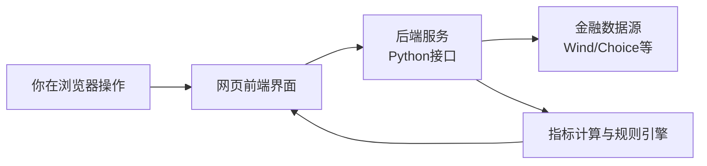
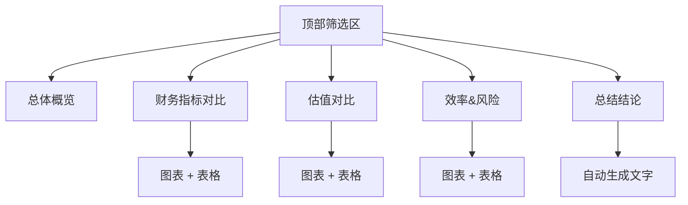
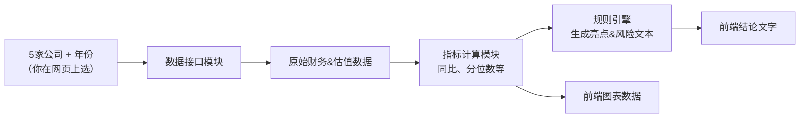
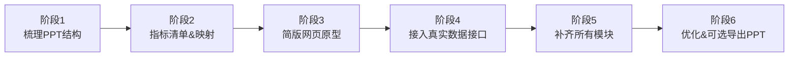

## 行业分析网页版看板：图形化规划

---

### 1. 整体流程一图看懂



**解释（只记住感觉即可）：**

- 你只接触 **左边的“你在浏览器操作”和网页界面”**。
- 中间的后端和右边的数据源/计算，是程序在背后帮你干活。

---

### 2. 网页长什么样（模块结构图）



**你在页面上大概会看到：**

- **顶部筛选区**：时间范围 + 5 家公司勾选 + 一个“刷新分析”按钮。
- 下面按块排版：
  - **总体概览**：收入/利润总体对比 + 几条总的结论。
  - **财务指标对比**：收入、净利、毛利率、ROE 等图 + 表。
  - **估值对比**：PE、PB、PS 与行业中位数/分位数。
  - **效率&风险**：周转率、杠杆等。
  - **总结结论**：推荐/风险几条话。

---

### 3. 数据从哪里来、怎么变成你看到的图



**简单理解：**

1. 你选 **公司 + 时间**。
2. 程序去 **数据源** 拉原始数据。
3. 计算各种指标（同比、分位数、行业中位数等）。
4. 用一套你事先给的“财务分析规则”，生成“亮点/风险”文字。
5. 把这些数字和文字喂给网页 → 你看到的就是图和表。

---

### 4. 分阶段实施（像项目进度条）



**每个阶段你要做/看到的：**

- **阶段1：梳理PPT结构**
  - 我根据你现在的 PPT 列出：有哪些页、每页有哪些图/表、用到什么指标。
  - 你只需要看清单：**“对/不对，有没有漏的”**。

- **阶段2：指标清单 & 映射**
  - 做一张表：“你熟悉的指标名 → 数据源字段 → 口径说明”。
  - 你确认：这些口径是否和你 PPT 一致。

- **阶段3：简版网页原型**
  - 做出一个很简单的网页，只包含：
    - 顶部筛选区。
    - 1–2 个关键图（例如：收入 & 净利对比）。
  - 数据可以先用 Excel 假数据，这一步主要是让你 **看形状**。

- **阶段4：接入真实数据接口**
  - 后端接 Wind/Choice 获取真实数据。
  - 和你现有 PPT/Excel 对账，确认数字没问题。

- **阶段5：补齐所有模块**
  - 把 PPT 里的各个模块（估值、效率、风险等）逐一搬到网页。
  - 把你常用的分析语句写成规则，自动生成“亮点/风险”。

- **阶段6：优化 & 可选导出PPT**
  - 调整样式、加载速度。
  - 二期如果需要，再加一个“导出为 PPT”功能，直接用网页中的数据生成 PPT。

---

### 5. 你需要记住的“一个图 + 三句话”

- **一个图**：  
  就是“**整体流程图**”：  
  > 你在浏览器点一下 → 后端去取数据 → 算出指标 → 网页显示成图表 + 文本。

- **三句话**：  
  - 一期目标：**先做能在浏览器看数据和结论的“电子版 PPT”**，不强求导出 PPT。  
  - 原则：**页面结构基本照搬你现有 PPT，只是变成交互的网页。**  
  - 分工：**你负责定义“看什么、怎么解读”，程序负责“去哪里取、怎么算、怎么画”。**

---

### 6. 网页界面草图（线框图）

下面是一个“长什么样”的文字版示意，你可以当成网页的大致布局：

```text
┌───────────────────────────────────────────────┐
│ 顶部导航/标题：化妆品行业 2021–2025 同行对比看板 │
└───────────────────────────────────────────────┘

┌───────────────────────────────────────────────┐
│ 顶部筛选区                                   │
│  ┌───────────┬────────────┬─────────────┐   │
│  │ 时间范围  │ 公司选择   │ 粒度选择     │   │
│  │ [2021-2025] [5家公司多选] [年度/季度] │   │
│  └───────────┴────────────┴─────────────┘   │
│                          [ 刷新分析 按钮 ]  │
└───────────────────────────────────────────────┘

┌───────────────────────────────────────────────┐
│ 模块一：总体概览                             │
│  ┌───────────────────────────────────────┐   │
│  │ 图：收入 & 净利润 总体对比（折线/柱状） │   │
│  └───────────────────────────────────────┘   │
│  文本：3–5 条总的结论（增长、盈利、趋势）     │
└───────────────────────────────────────────────┘

┌─────────────────────────────┬─────────────────┐
│ 模块二：财务指标对比        │ 模块三：估值对比 │
│  - 收入及增速图+表          │  - PE / PB / PS  │
│  - 净利润及增速图+表        │  - 行业中位数线  │
│  - 毛利率/净利率图+表       │  - 简短估值结论  │
│  - ROE/ROA 图+表            │                 │
└─────────────────────────────┴─────────────────┘

┌───────────────────────────────────────────────┐
│ 模块四：效率 & 风险                           │
│  - 存货周转率 图+表                           │
│  - 应收周转率 图+表                           │
│  - 资产负债率/杠杆 图+表                      │
│  文本：风险提示若干条                         │
└───────────────────────────────────────────────┘

┌───────────────────────────────────────────────┐
│ 模块五：总结结论                             │
│  - 推荐重点关注公司/组合（自动生成）          │
│  - 主要风险提示（自动生成）                   │
└───────────────────────────────────────────────┘
```

你可以把它理解为：

- **从上到下**：先选条件 → 看整体 → 再看细分 → 最后看总结。
- **从左到右**：中间是图表，旁边是结论文字，整体感觉就像把 PPT 展开成一张长网页。
