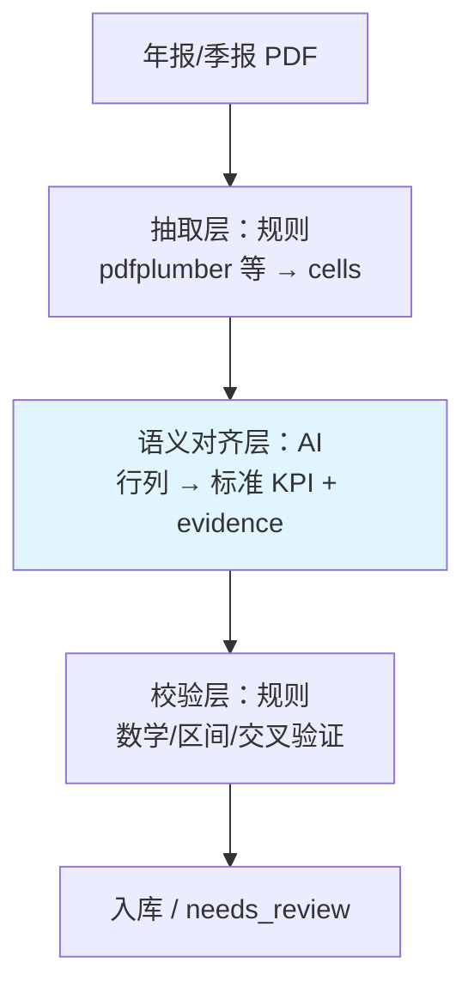
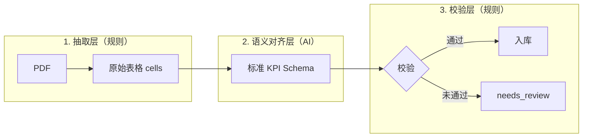
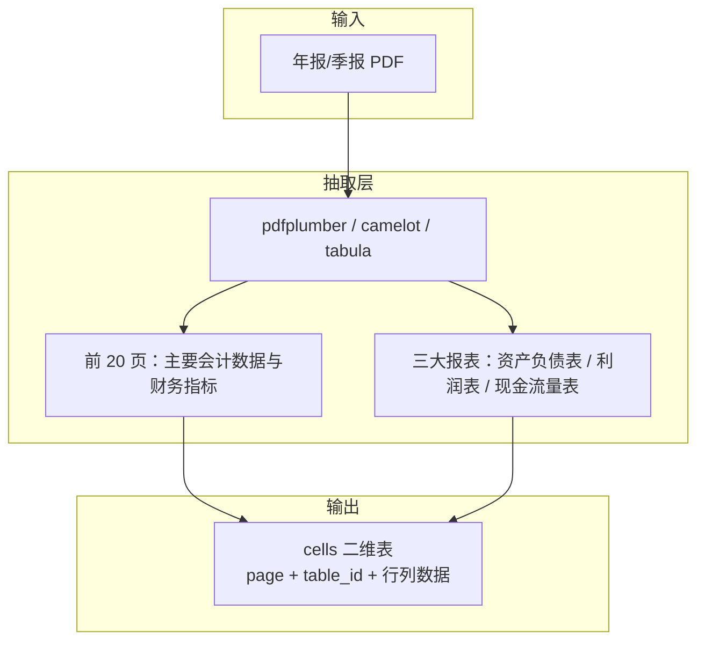
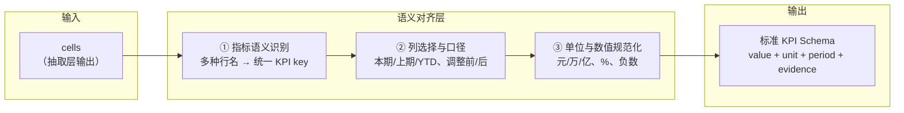
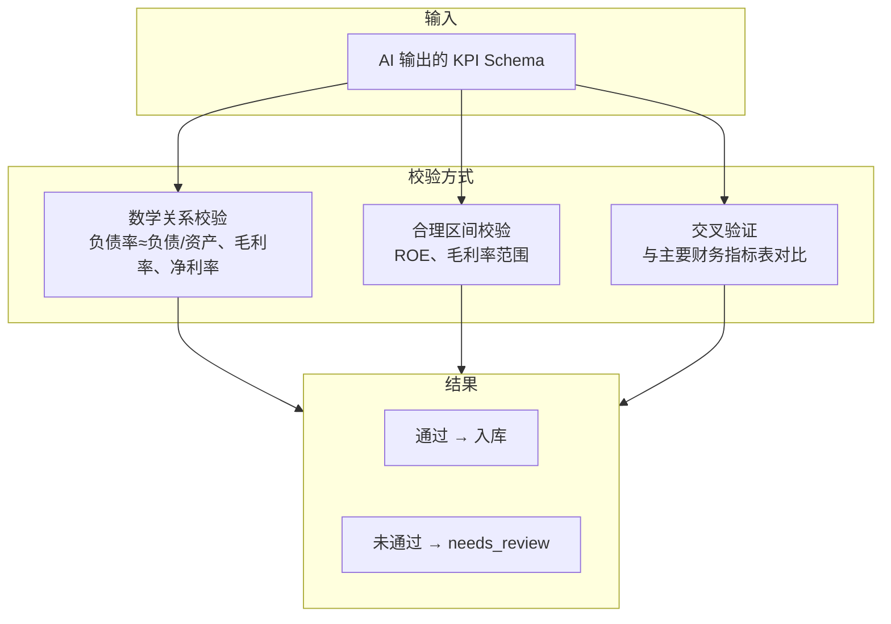
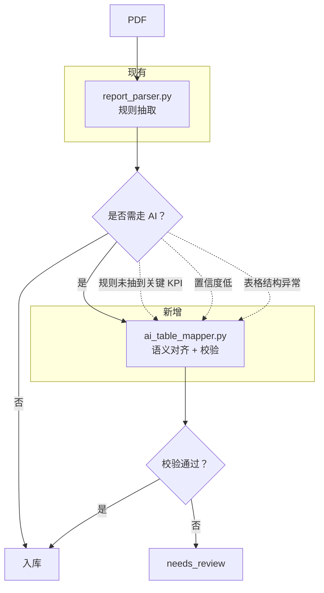

# TPFinancials 技术方案说明（AI + 规则混合解析）

## 文档总览（一图看懂）



---

## 1. 背景与问题

当前 TPFinancials 项目主要通过 **正则 + 表格规则** 从上市公司年报/季报 PDF 中提取财务 KPI（如营业收入、净利润、ROE 等）。

该方案在早期验证阶段是**必要且正确的**，但随着覆盖公司与交易所增多，逐渐暴露出以下问题：

* 不同交易所（深交所 / 上交所）披露模板存在差异
* 同一指标存在多种表述（如“归属于上市公司股东的净利润” vs “归属于母公司所有者的净利润”）
* 列结构不稳定（本期 / 上期 / 年初至今 / 调整前 / 调整后）
* 纯正则对表格位移、单位变化（元 / 万元 / 亿元）鲁棒性不足

因此，需要引入 **AI 作为“语义对齐与结构理解层”**，但同时保持数据抽取的可追溯性与确定性。

---

## 2. 总体设计原则

**核心原则：AI 不直接“读 PDF 报数”，而只负责“解释表格语义”。**

采用三层架构：



1. **抽取层（Deterministic）**：负责把 PDF → 原始文本 / 表格
2. **语义对齐层（AI）**：负责把“表格里的行列”映射到标准 KPI Schema
3. **校验层（Rule-based）**：对 AI 输出进行数学与逻辑校验

这样可以：

* 最大化降低 LLM 幻觉风险
* 保留完整证据链（page / row / column）
* 支持人工回溯与调试

---

## 3. 架构分层说明

### 3.1 抽取层（规则 + 表格）



**目标**：只做事实抽取，不做任何“理解”。

**职责**：

* 使用 `pdfplumber` / `camelot` / `tabula` 抽取 PDF 中的二维表格
* 重点关注：

  * 前 20 页中的“主要会计数据和财务指标”
  * 财务报告章节中的三大报表（资产负债表 / 利润表 / 现金流量表）

**输出结构（示意）**：

```json
{
  "page": 6,
  "table_id": "tbl_6_1",
  "cells": [
    ["项目", "2024年", "2023年"],
    ["营业收入", "1,728,185,916.69", "2,762,392,311.95"],
    ["归属于上市公司股东的净利润", "-24,400,328.98", "29,527,562.99"]
  ]
}
```

---

### 3.2 语义对齐层（AI 核心价值）



**目标**：解决“说法不同、结构不同”的问题。

AI 在此层负责：

1. **指标语义识别**

   * 将多种行名对齐到统一 KPI key
   * 示例：

     * “归属于上市公司股东的净利润”
     * “归属于母公司所有者的净利润”
       → `net_profit`

2. **列选择与口径判断**

   * 本期 vs 上期 vs 年初至今（YTD）
   * 调整前 vs 调整后（默认取“调整后”）

3. **单位与数值规范化**

   * 元 / 万元 / 亿元
   * 百分比 / 小数
   * 负数（括号或前缀）

**输入**：抽取层输出的 `cells`

**输出（必须结构化）**：

```json
{
  "revenue": {
    "value": 1728185916.69,
    "unit": "CNY",
    "period": "FY2024",
    "evidence": {"page": 6, "row": 1, "col": 1}
  },
  "net_profit": {
    "value": -24400328.98,
    "unit": "CNY",
    "period": "FY2024",
    "evidence": {"page": 6, "row": 2, "col": 1}
  },
  "warnings": ["detected adjusted columns, used 调整后"]
}
```

> **强制要求**：每一个数值必须能追溯到具体 page / row / col。

---

### 3.3 校验层（强约束）



**目标**：防止 AI 输出错误或不一致结果。

校验方式包括：

* 数学关系校验：

  * 资产负债率 ≈ 负债合计 / 资产总计
  * 毛利率 ≈ (收入 - 成本) / 收入
  * 净利率 ≈ 净利润 / 收入

* 合理区间校验：

  * ROE ∈ [-200%, +200%]
  * 毛利率 ∈ [-50%, +100%]

* 交叉验证：

  * 与“主要财务指标表”中的同口径指标对比

**结果策略**：

* 通过校验 → 入库
* 未通过 → 标记 `needs_review = true`

---

## 4. KPI Schema（建议统一口径）

| KPI Key            | 含义        | 备注           |
| ------------------ | --------- | ------------ |
| revenue            | 营业收入      | FY / YTD / Q |
| net_profit         | 归母净利润     |              |
| net_profit_excl    | 扣非净利润     |              |
| total_assets       | 总资产       | 期末           |
| total_liabilities  | 负债合计      |              |
| equity             | 净资产       |              |
| operating_cashflow | 经营活动现金流   |              |
| cash_equivalents   | 现金及现金等价物  |              |
| gross_margin       | 毛利率       | 计算得出         |
| net_margin         | 净利率       | 计算得出         |
| roe                | ROE       | 优先用披露值       |
| asset_turnover     | 资产周转率     | 计算           |
| revenue_cagr       | 营业收入 CAGR | 跨年计算         |

---

## 5. 推荐模型与部署方式

### 本地模型（推荐）

* Qwen2.5 / DeepSeek 系列（中文表格理解能力强）
* 部署方式：Ollama / vLLM

### 云模型（快速验证）

* 支持 JSON Schema 的 LLM
* 需开启严格 `response_format`

---

## 6. 与现有 TPFinancials 的集成方式



* 保留现有 `report_parser.py` 中的规则抽取
* 新增模块：`ai_table_mapper.py`
* 触发条件：

  * 规则未抽到关键 KPI
  * 抽取结果置信度低
  * 表格结构异常（多列 / 调整前后）

---

## 7. 总结

* **规则负责确定性，AI 负责理解差异**
* AI 不替代现有代码，而是作为增强层
* 该架构可扩展到更多公司、交易所与历史年报

> 本文档作为 TPFinancials 项目中长期维护与演进的技术参考文档。
