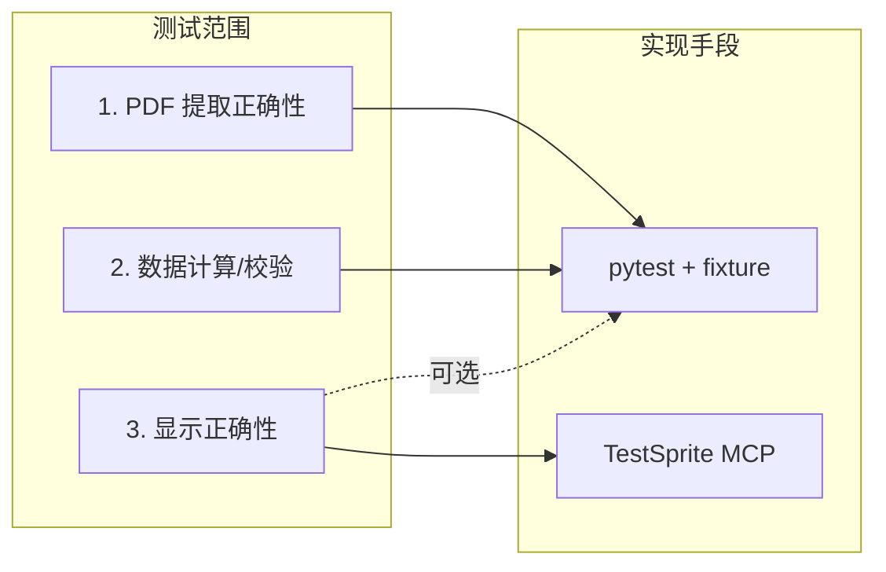

# TPFinancials 自动化测试方案（techPlanning3）

## 文档总览（一图看懂）



- **1. 提取、2. 计算**：用 **pytest + fixture**（ground truth 来自 PPT 或 mock）。
- **3. 显示**：优先用 **TestSprite** 做 UI/API 自动化；可选 pytest 做 `buildDataFromRecords` 契约测试。

---

## 1. 目的与测试范围

| 层次 | 目标 | 说明 |
|------|------|------|
| **1. PDF 提取正确性** | 给定 PDF，解析出的指标与预期一致（容差可配） | 测 `report_parser` / `annual_report_parser` 输出 |
| **2. 数据计算/校验** | 公式正确（若引入计算层）；或合理性校验（区间、比例一致） | 与 [techPlanning2](techPlanning2.md) 校验层对齐 |
| **3. 显示正确性** | 看板展示的数据与 `records` 一致；API 契约稳定 | UI/E2E + `/api/data` 结构与关键字段 |

---

## 2. TestSprite 能做到什么程度

[TestSprite](https://www.testsprite.com/use-cases/en/cursor-testing-tool) 通过 **MCP** 接入 Cursor，自动生成并执行 UI、API、E2E 测试，在云端沙箱跑，结果与修建议回 Cursor。有**免费社区版**（每月刷新额度）。

### 2.1 适合用 TestSprite 的部分（低代码/无代码）

| 能力 | 在 TP Financials 中的用法 | 说明 |
|------|---------------------------|------|
| **UI / E2E** | 打开看板页，校验表格/图表是否展示、关键数值是否出现 | 无需手写 Playwright；由 TestSprite 根据项目/PRD 生成用例 |
| **API 测试** | 请求 `GET /api/data`，校验状态码、`records` 存在、必要字段（如 `roe_pct`）存在 | 契约与基础数据校验 |
| **Data / Schema 校验** | 校验返回 JSON 结构、关键字段类型与合理范围 | 可发现“缺字段”“类型错”等问题 |

可达到的效果：**显示层 + API/数据契约** 的自动化回归，无需或仅需很少手写测试代码。

### 2.2 TestSprite 不直接覆盖的部分

| 需求 | 原因 | 建议 |
|------|------|------|
| **PDF 解析结果 vs 预期值** | 领域特定（某 PDF → 某 KPI 数值）；无通用“解析正确性”插件 | 用 **pytest + expected_indicators.json** 做提取测试 |
| **ROE 等公式/计算正确性** | 无插件专门测“ROE = net_profit / total_equity”等逻辑 | 用 **pytest** 在计算/校验层写单测；TestSprite 可顺带校验 API 返回的 ROE 是否在合理区间 |

### 2.3 使用方式简述

- **安装**：按 [TestSprite MCP](https://www.npmjs.com/package/@testsprite/testsprite-mcp) 在 Cursor 中配置 MCP。
- **使用**：在 Cursor 中通过自然语言让 TestSprite 为该项目生成/运行 UI、API 测试（例如：“用 TestSprite 为 TP Financials 看板生成并执行 UI 和 /api/data 的 API 测试”）。
- **免费版**：社区版每月刷新 credits，可先用来验证“能做到什么程度”，再决定是否订阅。

---

## 3. Ground Truth 与 Mock 数据

- **PPT 作为 ground truth**：财务同事从《A股上市公司2021年-2025年同行业对比》PPT 整理出“公司–年份–指标”表或 JSON，与 [report_fetcher/pdf_indicators.md](report_fetcher/pdf_indicators.md) 字段一致（如 `revenue`, `net_profit`, `roe_pct` 等）。单位：金额为元，比率为 0–100。
- **可选：从 PPT 半自动导出**：扩展 [extract_pptx_text.py](extract_pptx_text.py)，按公司+年份解析表格数字并映射到标准 KPI，输出 `tests/fixtures/ground_truth_from_pptx.json`，人工校对后作 fixture。
- **Mock fixture**：手写 `tests/fixtures/expected_indicators.json`（1～2 公司、2～3 年）、`sample_records.json`（与 `financials.json` 的 `records` 结构一致），用于 CI 与不依赖 PPT 的回归。

---

## 4. 测试设计（目录与职责）

```
tests/
  fixtures/
    expected_indicators.json     # 提取测试期望（mock）
    sample_records.json         # 显示/契约测试用 records
    ground_truth_from_pptx.json # 可选，PPT 导出并校对
  test_extraction.py            # PDF 提取 vs expected_indicators
  test_calculations.py         # 计算/合理性校验（公式或区间）
  test_display.py              # buildDataFromRecords 或 API 契约（可选）
conftest.py                    # pytest 共享 fixture（路径、容差）
```

- **提取测试**：对 `_extract_indicators_from_pdf` 或 `AnnualReportParser().parse()` 传入 fixture PDF（或跳过无 PDF 的 CI），与 `expected_indicators.json` 在容差内比对。
- **计算测试**：若存在显式公式或 [techPlanning2](techPlanning2.md) 校验层，则对给定 record 断言通过/needs_review；可加合理性区间（如 ROE ∈ [-200, 200]）。
- **显示测试**：用 `sample_records.json` 调 `buildDataFromRecords` 或请求 `/api/data` 后做等价转换，断言 `finance[c.id].roe` 等与预期一致；**与 TestSprite 的 API/UI 测试互补**（TestSprite 做端到端与契约，pytest 做确定性数据映射）。

---

## 5. 扩展场景：更多 PDF、公司、指标时的测试需求

项目未来会引入**更多年报/季报 PDF、更多公司、更多财务指标**。当前第 1～4 节侧重“单点正确性”；扩展时还需考虑以下维度，否则会有缺口。

### 5.1 当前未显式覆盖的扩展需求

| 维度 | 风险 | 建议补充的测试需求 |
|------|------|---------------------|
| **更多指标** | 新增 KPI 时只改了 `RECORD_INDICATOR_KEYS`/`INDICATOR_LABELS`，忘记解析或前端展示，导致“有字段无数值”或“有数值无展示” | **Schema/契约回归**：指标清单（如 pdf_indicators.md 或 RECORD_INDICATOR_KEYS）与 parser 输出、API、前端使用的字段一致；新增指标时强制跑一轮“全字段存在性”检查 |
| **更多公司** | 不同交易所、不同报告模板（深交所/上交所、调整前/后）解析行为不一致，新公司引入新模板导致静默失败 | **代表性样本矩阵**：fixture 或 ground truth 覆盖“至少 1 家深交所 + 1 家上交所”“至少 1 份走调整后表格的 PDF”；新加公司时抽 1～2 份报告加入回归集 |
| **更多 PDF（年报/季报）** | 季报与年报结构不同，解析路径或 period 处理不同；仅用年报 fixture 会漏掉季报 regressions | **报告类型维度**：提取测试按 `report_type`（年报/一季报/半年报/三季报）至少各保留 1 个样本；显示测试考虑 period 为 `"2024"` vs `"2024Q1"` 的映射 |
| **Ground truth 规模** | 公司/年份/指标增多后，人工维护的 PPT 或 JSON 成本高，且易与代码不同步 | **单源真相**：以 RECORD_INDICATOR_KEYS 或 pdf_indicators.md 为指标定义的唯一来源；fixture 与 parser/前端约定“新增指标必须在此登记并补 fixture 或测试” |
| **数据质量与一致性** | 同公司同一年多条 record（如年报+半年报）、单位混用（元/万/亿）、缺失率激增 | **一致性/质量测试**：可选用例——同 (stock_code, period) 唯一性；金额/比率单位与合理区间；缺失率监控（如某批解析后 null 占比告警） |
| **UI/展示扩展** | 看板新增公司或新图表时，TestSprite 的 UI 断言大面积失败或漏测新区域 | **UI 测试策略**：按“关键路径”（如总览、财务表、ROE 图）设计断言，避免硬编码所有单元格；新指标/新公司上线时把对应断言纳入 TestSprite 或 pytest 契约 |

### 5.2 扩展时的测试策略建议

- **指标扩展**：在 `conftest.py` 或单独脚本中，用 `RECORD_INDICATOR_KEYS` / `pdf_indicators.md` 生成“全字段列表”，断言每条 record 的 key 集合与定义一致（或允许部分为 null）；新增指标时在 `expected_indicators.json` 或 ground truth 中补至少一条期望值。
- **公司/PDF 扩展**：维护一个**小型矩阵**（例如 2 公司 × 2 报告类型 × 2 年），而不是“全量 PDF 都测”；CI 跑矩阵内样本，全量或抽样回归可放在夜间/周任务。
- **季报**：在 fixture 中显式区分 `period`（`"2024"` vs `"2024Q1"` 等），提取与显示测试都覆盖到；`buildDataFromRecords` 若后续支持季度筛选，契约测试同步更新。
- **TestSprite**：与团队约定“新看板模块或关键路径上线时，同步更新 TestSprite 场景或 API 契约”，避免 UI/API 测试与产品脱节。

把上述内容纳入规划后，techPlanning3 在“更多 PDF、更多公司、更多指标”下才能说**基本涵盖**项目的测试需求；实施时可按优先级先做 Schema/契约与代表性样本矩阵，再补数据质量与 UI 策略。

---

## 6. 与现有架构的关系

- **与 [techPlanning2](techPlanning2.md)**：校验层通过/不通过的用例可落在 `test_calculations.py`；TestSprite 不替代校验层，只在外层做 API/UI 回归。
- **与 [report_parser](report_parser.py) / [annual_report_parser](annual_report_parser.py)**：提取测试直接断言解析输出与 fixture 或 ground truth 一致。
- **与 [js/app.js](js/app.js)**：`buildDataFromRecords` 的契约可由 pytest 或前端单测覆盖；实际页面行为与“显示是否正确”由 TestSprite UI/E2E 覆盖。

---

## 7. 实施步骤（含 TestSprite）

1. **TestSprite 验证（先看能做到什么程度）**
   - 在 Cursor 中配置 TestSprite MCP（见其文档）。
   - 用自然语言让 TestSprite 为 TP Financials 生成并运行：① 看板 UI/E2E；② `GET /api/data` 的 API/数据校验。
   - 根据结果确定：哪些断言可稳定交给 TestSprite，哪些仍需 pytest 做精确数值比对。

2. **pytest 基础（不依赖 TestSprite）**
   - 新增 `tests/`、`tests/fixtures/`，加入 `expected_indicators.json`、`sample_records.json`。
   - 实现 `test_extraction.py`、`test_display.py`（及可选 `test_calculations.py`），CI 中运行 `pytest tests/`。

3. **Ground truth 与 PPT**
   - 与财务同事约定 ground truth 格式，整理最小集（如 2 公司 × 3 年）。
   - 可选：扩展 `extract_pptx_text.py` 产出 `ground_truth_from_pptx.json`，校对后接入 `test_extraction.py`。

4. **持续分工**
   - **TestSprite**：显示正确性 + API/数据契约的自动化回归（低代码）。
   - **pytest**：PDF 提取正确性、数据计算/校验正确性，以及需要精确容差比对的显示层契约。

---

## 8. 总结

- **TestSprite**：适合把“显示正确性”和“API/数据契约”做到可重复、可排期的自动化，无需或极少手写测试代码；先用免费版验证能覆盖的范围。
- **pytest + fixture**：覆盖 PDF 提取正确性、数据计算/校验，以及需要与 ground truth 精确比对的场景。
- 两者分工明确：TestSprite 做端到端与契约；pytest 做领域逻辑与数值正确性。

> 本文档与 [techPlanning2](techPlanning2.md) 并列，作为 TP Financials 测试与质量保障的技术参考。
